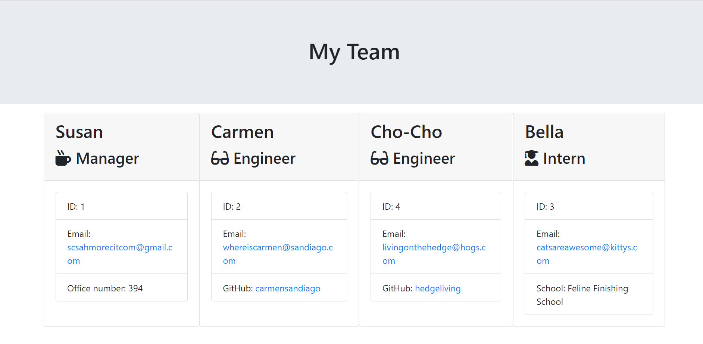

# Team_Profile_Generator

## About

This project aims to generate an html team profile page via inquire using user inputs. 

## Install 

This program requires inquire, jest, and node.

## Use
A linke the a video displaying the applicatoin in use:
https://drive.google.com/file/d/1sRLtCFYnLI_fJje0SfQWplp_87E-8VYN/view?usp=sharing

The user must access this application in the terminal, install nessecary packages, and then run the spplicaiton. The user will then be prompted for a manager's name, id, email, and office number. The user will then be allowed to add either engineers or interns to the team. If an engineer is added, the user will be promted for the engineer's name, id, email, and GitHub. If an intern is added, the user will be promted for the intern's name, id, email, and school. Once the user has added all desierable team members, an html page will be generated with cards containing all infromation the user provided. Example below:

